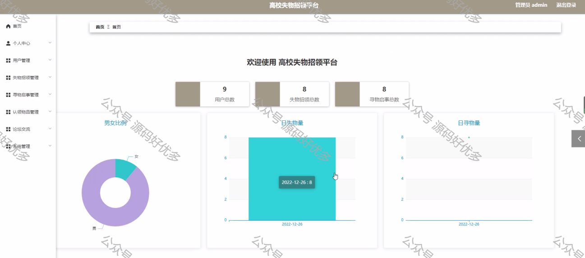

 
## 查看主页获取源码

> **作者介绍**： **✌**全网粉丝10W+本平台特邀作者、博客专家、CSDN新星计划导师、java领域优质创作者,博客之星、掘金/华为云/阿里云/InfoQ等平台优质作者、专注于项目实战 **✌**

  

### 一、作品包含

源码+数据库+设计文档万字+PPT+全套环境和工具资源+部署教程

### 二、项目技术

前端技术：Html、Css、Js、Vue、Element-ui

数据库：MySQL

后端技术：Java、Spring Boot、MyBatis

  

### 三、运行环境

开发工具：IDEA/eclipse

数据库：MySQL5.7

数据库管理工具：Navicat10以上版本

环境配置软件： JDK1.8+Maven3.6.3

前端Nodejs：14

  

### 四、项目介绍
项目编号：springbootA071

高校失物招领平台主要通过计算机网络，对高校失物招领平台的信息进行统一管理，方便管理员随时随地进行增添、修改、查询、删除各类信息，也方便用户查询失物招领、寻物启事、论坛交流等。本系统极大的促进了系统与数据库管理系统软件之间的配合，满足了绝大部分用户的需求，给用户带来了很大的便利。以现在计算机的技术的应用，使计算机成为人们使用现代发达技术的桥梁。计算机可以有效的解决信息，十分方便的获取信息，从而提高工作的效率

### 五、运行截图

  
